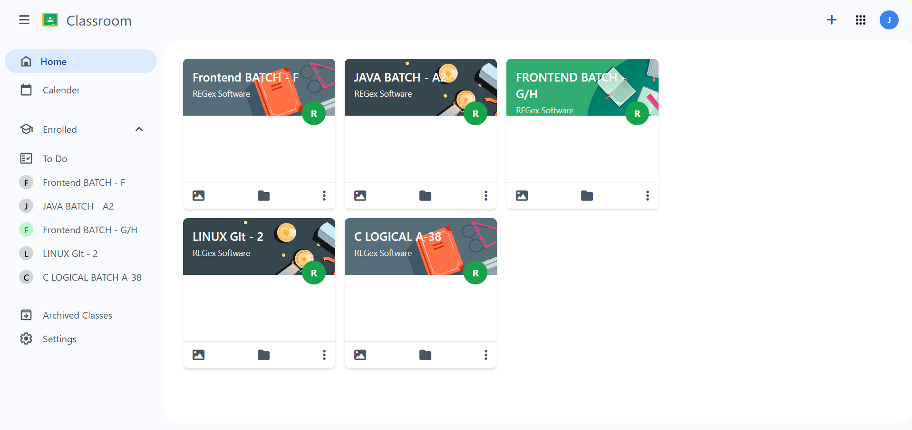

<div align="center">
  
  <h1>Google Classroom UI Clone</h1>
  <h4>A responsive Google Classroom interface clone built with 
      <a href="https://tailwindcss.com" target="_blank">Tailwind CSS</a> and HTML.</h4>

  <p>
    <a href="https://jatinsoni08.github.io/GoogleClassroomClone/">View Live Demo</a> ·
    <a href="https://github.com/jatinsoni08/GoogleClassroomClone/issues">Report Bug</a> ·
    <a href="https://github.com/jatinsoni08/GoogleClassroomClone/issues">Request Feature</a>
  </p>

  <p>
    
    
    
    
    
  </p>

  <p>
    <a href="#key-features">Key Features</a> •
    <a href="#tech-stack">Tech Stack</a> •
    <a href="#responsive-design">Responsive Design</a> •
    <a href="#installation">Installation</a> •
    <a href="#usage">Usage</a> •
    <a href="#project-structure">Project Structure</a> •
    <a href="#preview">Preview</a> •
    <a href="#license">License</a>
  </p>

  <div style="display: flex; justify-content: center; gap: 20px; flex-wrap: wrap;">
     <br>
   
  </div>
</div>

---


## ✨ Key Features

- **🎨 Modern UI** - Clean interface with Google Classroom's signature styling
- **🏫 Class Cards** - Visual representation of classes with color coding
- **🎯 Pure Tailwind CSS** - Minimal custom CSS, mostly Tailwind utility classes
- **🌈 Beautiful Icons** - Google Material Icons and custom SVG elements

---

## 🛠️ Tech Stack

| Technology | Purpose |
|------------|---------|
|  **HTML5** | Semantic markup structure |
|  **Tailwind CSS** | Utility-first CSS framework |
|  **Material Icons** | Icon library for UI elements |
|  **Vanilla JavaScript** | Interactive functionality |

---


## 🚀 Installation

No build process required! Simply follow these steps:

1. **Clone the repository**
   ```bash
   git clone https://github.com/jatinsoni08/GoogleClassroomClone.git
